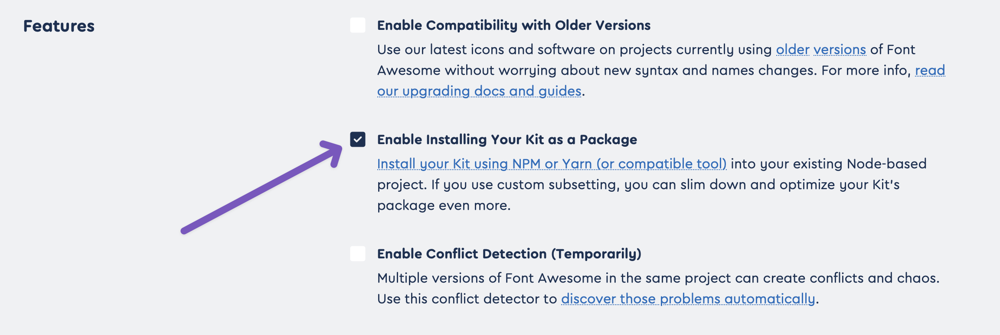
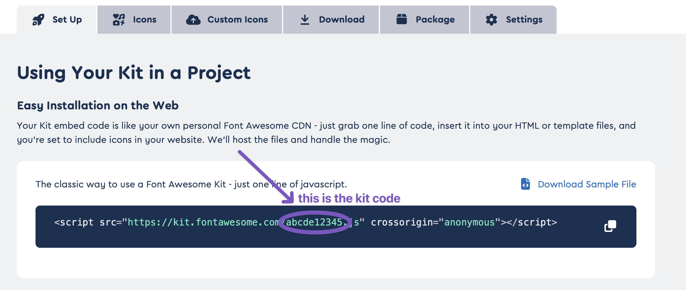

# Font Awesome Pro

<div class="annotate" markdown>

If you have an active [Font Awesome Pro](https://fontawesome.com/plans) subscription(1), you
can use it with RIL in just two easy steps.
{ .annotate }

</div>

1. You must be **actively paying** for Font Awesome Pro. A perpetual fallback license won't cut it.

First, enable Font Awesome Pro via the `fontawesome.pro_enabled` setting.

???+ config "`fontawesome.pro_enabled`: Controls whether Font Awesome Pro is enabled."
    `fontawesome.pro_enabled` controls whether RIL allows the use of icons exclusive to Font Awesome Pro.

    === "pyproject.toml"

        ```toml
        [tool.ril.fontawesome]
        pro_enabled = true
        ```

    === "ril.toml"

        ```toml
        [fontawesome]
        pro_enabled = true
        ```

    === "Environment variables / .env"

        ```shell
        RIL_FONTAWESOME__PRO_ENABLED=true
        ```


Second, set the `FONTAWESOME_PACKAGE_TOKEN` environment variable to your 
[Font Awesome package token](https://fontawesome.com/account/general#tokens).

???+ config "`FONTAWESOME_PACKAGE_TOKEN`: Your Font Awesome package token."

    A Font Awesome package token enables access to Font Awesome's private, Pro-only, package registry.

    This special setting can only be configured via an environment variable or `.env` file and is not prefixed
    with `RIL_`.

    === "Environment variables / .env"

        ```shell
        FONTAWESOME_PACKAGE_TOKEN=XXXXXXXX-XXXX-XXXX-XXXX-XXXXXXXXXXXX
        ```

That's it — you can now use Pro icons without any further setup.

## Using a Kit

Kits are all-in-one management utilities for Font Awesome icons. You can read more about them at
[Font Awesome's documentation](https://docs.fontawesome.com/web/setup/use-kit).

Using Kits with RIL is a simple, four-step, process.

!!! tip "There is literally no downside to using a Kit"
    Using a Kit helps you save on registry bandwith and allows you to use [custom icons](#using-custom-icons).
    It also means RIL's Font Awesome component introduces only three Node.js dependencies to your project instead
    of [up to 13](https://docs.fontawesome.com/web/setup/packages#svg-icon-packages).

    Kits should be always be preferred over plain Font Awesome Pro.

### Setup

First, follow the instructions above to set up Font Awesome Pro.

Second, [choose the Kit you want to use](https://fontawesome.com/kits)
(or [create a new one](https://fontawesome.com/kits/new)), head into its settings, and ensure **Features** > 
**Enable Installing Your Kit as a Package** is checked.

{ align=left }

Third, find your Kit code. Use the image below as a reference.



Finally, set the `fontawesome.kit_code` setting to your Kit code.

???+ config "`fontawesome.kit_code`: A Font Awesome Kit code."
    Setting `fontawesome.kit_code` allows you to use the corresponding Kit with RIL.

    === "pyproject.toml"

        ```toml
        [tool.ril.fontawesome]
        kit_code = "abcde12345"
        ```

    === "ril.toml"

        ```toml
        [fontawesome]
        kit_code = "abcde12345"
        ```

    === "Environment variables / .env"

        ```shell
        RIL_FONTAWESOME__KIT_CODE=abcde12345
        ```


### Using custom icons

You can use [custom icons](https://docs.fontawesome.com/web/add-icons/upload-icons) via `#!python fa.kit()`.

```python
import RIL as icons

icons.fa.kit("name-of-icon")
```

!!! info "Duotone custom icons are unavailable for now"
    Duotone custom icons are currently not availble in Kit packages, so you can't use them with RIL. 
    This is a limitation on Font Awesome's side, so you'll have to wait for things to change on their end.

### Updating Kits

If you add, remove, or edit icons or styles in your Kit, you can get those changes in your Reflex project by
having Reflex reinstall your project's frontend packages:

```shell
reflex init && reflex run
```

## Continous integration

If you plan to build your Reflex project's frontend in a continuous integration environment, you are strongly advised to
cache your dependencies in order to preserve your registry bandwith.

!!! question "Do I need to worry about this?"
    This only applies to users who are statically building their project's frontend with `reflex export` in a CI
    environment. If you're unsure whether that's you, it probably isn't.

Your cache should be keyed on both `.web/bun.lockb` and `.web/package-lock.json`. (1)
{ .annotate }

1. If the `REFLEX_WEB_WORKDIR` environment variable is set, use its value in place of `.web`.

Below are links to the relevant documentation for several popular CI providers:

- [:fontawesome-brands-github: GitHub Actions](https://docs.github.com/en/actions/advanced-guides/caching-dependencies-to-speed-up-workflows)
- [:fontawesome-brands-gitlab: GitLab](https://docs.gitlab.com/ee/ci/caching/)
- [:simple-circleci: CircleCI](https://circleci.com/docs/2.0/caching/)
- [:simple-travisci: Travis CI](https://docs.travis-ci.com/user/caching/)
- [:fontawesome-brands-bitbucket: Bitbucket Pipelines](https://support.atlassian.com/bitbucket-cloud/docs/cache-dependencies/)

## Using alternate registries (advanced)

You can use the `fontawesome.npm_registry` setting to specify an alternate registry from which 
to install Font Awesome Pro packages. The registry must implement the 
[CommonJS package registry specification](https://wiki.commonjs.org/wiki/Packages/Registry).

This is an advanced capability that most users won't need.

???+ config "`fontawesome.npm_registry`: Controls where Reflex will install Font Awesome Pro packages from."
    `fontawesome.npm_registry` controls the registry from which Reflex will install packages in the `@fortawesome`
    and `@awesome.me` namespaces.

    === "pyproject.toml"

        ```toml
        [tool.ril.fontawesome]
        npm_registry = "https://example.registry.com"
        ```

    === "ril.toml"

        ```toml
        [fontawesome]
        npm_registry = "https://example.registry.com"
        ```

    === "Environment variables / .env"

        ```shell
        RIL_FONTAWESOME__NPM_REGISTRY="https://example.registry.com"
        ```

## Troubleshooting

### "Incorrect or missing password" error

If you're trying to use Font Awesome Pro icons and NPM emits an error like:

```{ .text .no-copy .no-select }
npm error code E401
npm error Incorrect or missing password.
```

It's probably because your Font Awesome package token is incorrect or missing. You should:

- Double-check that the token matches the one on your [Font Awesome account page](https://fontawesome.com/account/general#tokens).
- Make sure your token is exposed by the `FONTAWESOME_PACKAGE_TOKEN` environment variable. Casing doesn't matter,
but the spelling must otherwise be exact. There are no alternative ways of setting a token — trying to put it in a `pyproject.toml`
or `ril.toml` file won't work.
      - If you're using a `.env` file, make sure it's located in the current working directory — i.e., the directory in which
      `reflex run` or `reflex export` is being executed. Also, make sure it's named `.env` *exactly*.

If things still aren't working, [open an issue](https://github.com/celsiusnarhwal/RIL/issues/new).